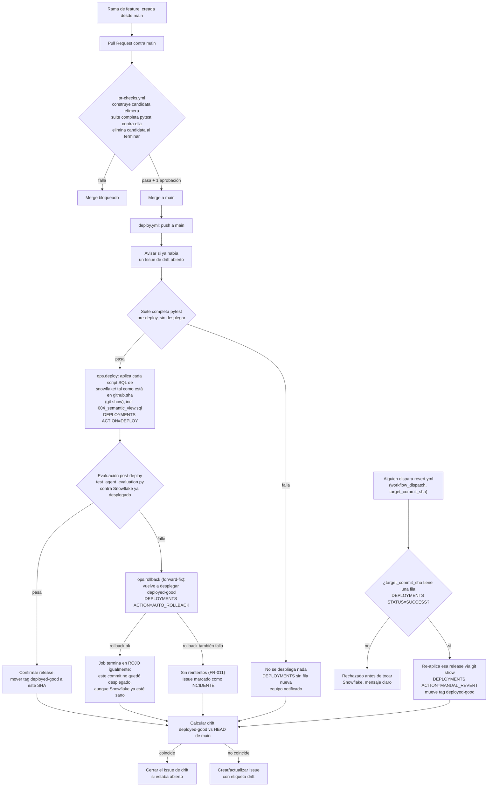

# CI/CD sobre Snowflake: proceso, decisiones y versionado de semantic views

> Documento de referencia para el equipo. Consolida lo implementado en la feature
> [004-ci-cd-pipeline](../specs/004-ci-cd-pipeline/spec.md) y el razonamiento detrás de cada
> decisión, ya detallado en los ADR de esa feature. Este fichero no sustituye a los ADR, los
> resume y los conecta en un único sitio.
>
> Fuentes primarias: [spec.md](../specs/004-ci-cd-pipeline/spec.md),
> [plan.md](../specs/004-ci-cd-pipeline/plan.md),
> [research.md](../specs/004-ci-cd-pipeline/research.md),
> [contracts/workflows.md](../specs/004-ci-cd-pipeline/contracts/workflows.md),
> [ADR-001](../specs/004-ci-cd-pipeline/decisions/001-estrategia-de-revert.md),
> [ADR-002](../specs/004-ci-cd-pipeline/decisions/002-rollback-automatico.md),
> [ADR-003](../specs/004-ci-cd-pipeline/decisions/003-simplificacion-semantic-view.md).

## 1. Resumen: los tres workflows

| Workflow | Disparador | Qué hace | Qué NO hace |
|---|---|---|---|
| [`pr-checks.yml`](../.github/workflows/pr-checks.yml) | PR abierta/actualizada contra `main` | Construye una copia efímera y aislada de la semantic view ("candidata", `SV_PHARMA_SALES_PR<n>`), ejecuta la suite completa de `pytest` contra ella y la elimina al terminar. Es el *required status check* de la protección de rama. | No toca la semantic view de producción, no despliega nada más, no toca `main`, no usa el Environment `production`. |
| [`deploy.yml`](../.github/workflows/deploy.yml) | `push` a `main` (cada merge) | Re-ejecuta la suite completa; si pasa, despliega la release (agente + semantic view); ejecuta la evaluación post-deploy contra lo ya desplegado; si falla, dispara rollback automático (*forward-fix*); al final, siempre recalcula el estado de *drift*. | No hace commits automáticos en `main`, no reintenta un rollback fallido. |
| [`revert.yml`](../.github/workflows/revert.yml) | Manual (`workflow_dispatch`, input `target_commit_sha`) | Reactiva una release ya desplegada con éxito anteriormente (agente + semantic view juntos). | No acepta un SHA sin despliegue `SUCCESS` previo registrado. |

La lógica de negocio (aplicar SQL, registrar auditoría, decidir a qué commit volver) vive en
Python puro en `src/conversational_analytics/ops/` (`deploy.py`, `rollback.py`, `revert.py`,
`drift.py`, `deployments_log.py`, `sql_runner.py`), no en `bash` incrustado en el YAML. Esto es
lo que permite testear el rollback con `pytest` (`tests/test_ops_deploy.py`,
`tests/test_ops_drift.py`, `tests/test_ops_rollback.py`, `tests/test_ops_revert.py`) en vez de
confiar en que "funciona porque lo hemos leído dos veces".

## 2. Diagrama del proceso completo

Puntos que no son evidentes solo mirando el diagrama:

- El check de `pr-checks.yml` corre contra una copia efímera y aislada de la semantic view
  ("candidata", un objeto `SV_PHARMA_SALES_PR<n>` por PR) que se construye al empezar y se
  elimina al terminar — nunca toca la de producción. Ver
  [contracts/pr-candidate-workflow.md](../specs/005-pr-checks-semantic-isolation/contracts/pr-candidate-workflow.md)
  y §5.5 para el diseño y el porqué de este cambio respecto al diseño original de la feature 004.
- El paso "Job termina en ROJO igualmente" tras un rollback exitoso es intencional: el commit que
  falló no debe aparecer como desplegado con éxito, aunque el *forward-fix* ya haya dejado
  Snowflake en un estado sano. Es el mecanismo que hace visible el *drift* en el paso siguiente.
- `revert.yml` y `deploy.yml` comparten el mismo grupo de `concurrency` (`deploy-production`):
  un revert manual y un despliegue automático nunca se solapan.

## 3. Nota operativa importante: los tests pueden fallar por variabilidad del LLM, no por un bug

Tanto `pr-checks.yml` como los dos pasos de test de `deploy.yml` (suite pre-deploy y evaluación
post-deploy) ejecutan tests que, en algún punto de la cadena, dependen de un LLM:

- **Cortex Analyst** traduce la pregunta en lenguaje natural a SQL.
- La capa de orquestación (SDK de OpenAI, apuntando a la API pública o al endpoint de Cortex)
  redacta/razona sobre el resultado.

Los asserts de `tests/test_agent_evaluation.py` comparan el resultado numérico contra una
consulta SQL baseline determinista (no un umbral genérico), precisamente para que el test no
dependa de la redacción del LLM. Aun así, **el SQL que genera Cortex Analyst para la misma
pregunta puede variar de una ejecución a otra** (elección de columnas equivalentes, forma de
agregar, alias, orden de joins), y esa variación ocasionalmente produce un resultado distinto al
esperado sin que haya ningún cambio de código de por medio.

Consecuencias prácticas a tener en cuenta:

- Un check en rojo en una PR o en `deploy.yml` **no siempre significa que el código esté roto**;
  puede ser una respuesta puntualmente distinta del LLM ante la misma pregunta. Antes de asumir
  una regresión, vale la pena relanzar el job.
- Esta variabilidad puede disparar un **rollback automático "en falso"**: la evaluación
  post-deploy falla por una respuesta atípica del LLM, no porque la release desplegada esté mal,
  y el pipeline revierte igualmente a `deployed-good`. Es un falso positivo aceptado
  conscientemente: la alternativa (relajar los asserts o añadir reintentos automáticos antes de
  decidir "release mala") diluiría la garantía del Principio II de la constitución
  ("ningún cambio... puede fusionarse ni desplegarse sin pasar la suite de evaluación completa").
- No se ha añadido *retry* automático a los tests de evaluación: encajaría mal con FR-011 ("si el
  propio rollback falla, no reintentar") y añadiría una fuente más de no-determinismo difícil de
  explicar en cinco minutos (Principio I). Si la tasa de falsos positivos se vuelve un problema
  real de uso diario, la vía a explorar sería fijar `temperature`/parámetros del modelo donde el
  proveedor lo permita, no reintentos ciegos.
- Esto es un trade-off conocido, no un defecto oculto: se documenta aquí para que nadie
  interprete un rollback puntual como una señal de que el pipeline "está roto".

## 4. Por qué el proceso es así: decisiones de diseño

### 4.1 Tres workflows separados, no uno con condicionales

`pr-checks`, `deploy` y `revert` tienen disparador, audiencia y nivel de permisos distintos
(principio de menor privilegio, OWASP): `pr-checks.yml` solo necesita `contents: read` y
secretos de repositorio; `deploy.yml` y `revert.yml` necesitan `contents: write` (mover el tag
`deployed-good`), `issues: write` (gestionar el Issue de *drift*) y acceso al Environment
`production`. Fusionarlos en un único fichero con `if` anidados sería más corto, pero mezclaría
permisos innecesarios y oscurecería justo lo que la demo quiere mostrar: qué pasa en cada
momento del ciclo de vida de un cambio. Detalle completo en
[research.md, D-02](../specs/004-ci-cd-pipeline/research.md#d-02-estructura-de-workflows--tres-ficheros-no-uno).

### 4.2 Rollback automático: *forward-fix*, no `git revert` ni Time Travel

Ante un fallo de la evaluación post-deploy, se evaluaron cuatro opciones
([ADR-002](../specs/004-ci-cd-pipeline/decisions/002-rollback-automatico.md)):

| Opción | Resumen | Por qué se descartó (si aplica) |
|---|---|---|
| **A — Forward-fix (elegida)** | Re-desplegar la última release conocida como buena (`deployed-good`), reutilizando exactamente el mismo job que el despliegue normal. | — |
| B — `git revert` automático + redespliegue | El pipeline hace `git revert` del merge y lo empuja a `main`. | Exige que el pipeline escriba commits en una rama protegida; un conflicto de revert bloquearía el propio rollback justo cuando más falta hace. |
| C — Time Travel / clonado de esquema | Clonar el esquema (*zero-copy*) antes de desplegar y restaurar el clon ante un fallo. | Restaura el esquema **entero**, incluidas escrituras legítimas posteriores (p. ej. telemetría); el estado desplegado pasaría a depender de un snapshot opaco en vez de Git, en contra del Principio III. |
| D — Sin rollback automático, solo alertar | Parar y esperar decisión humana. | Incumple el Principio III de la constitución, que exige rollback automático explícito. |

**Por qué se descarta específicamente Time Travel para el rollback** (más detalle en §5.3, donde
aplica también a la semantic view): el Time Travel de Snowflake protege **datos de tablas**, no
el DDL histórico de un objeto como una semantic view. No existe una operación nativa que
"deshaga" un `CREATE OR REPLACE`/`CREATE OR ALTER` sobre su definición. Además, restaurar un
esquema completo por Time Travel arrastraría también las filas de `DEPLOYMENTS` y
`AGENT_TELEMETRY` insertadas después del despliegue fallido, perdiendo la propia auditoría del
incidente.

La mecánica elegida:

1. `deploy.yml` despliega y corre la evaluación post-deploy.
2. Si pasa: mueve el tag Git ligero `deployed-good` a ese commit y dobla la auditoría en la tabla
   `DEPLOYMENTS` (ver §4.4).
3. Si falla: `ops/rollback.py` localiza el commit de `deployed-good`, relee cada script de
   `snowflake/` **tal como estaba en ese commit** (`git show <sha>:snowflake/<script>.sql`, no el
   working tree) y lo vuelve a aplicar con la misma función `apply_release_artifacts()` que usa
   el despliegue normal.
4. Si el propio rollback falla, el job termina en rojo **sin reintentar** (FR-011) y el Issue de
   *drift* se marca como incidente que requiere intervención manual.

Ventaja clave de reutilizar el mismo camino de código para desplegar y para revertir: el
rollback se ejercita en *cada* despliegue exitoso, no solo el día que hay un incidente. Es lo que
exige la constitución explícitamente: *"un rollback que nunca se ha ejecutado no es un
rollback"*.

### 4.3 Revert manual: release atómica, no por componente

Cada release agrupa dos artefactos de naturaleza muy distinta: el código del agente (sin estado,
trivial de revertir) y la semantic view (DDL con estado en el servidor). ADR-001 evaluó revertir
ambos por separado (mayor granularidad, estilo *expand/contract*) frente a tratarlos siempre como
una unidad atómica identificada por el commit SHA de `main`.

Se eligió la **unidad atómica**: el revert manual (`revert.yml`) y el rollback automático actúan
siempre sobre agente + semantic view juntos. Revertir solo el prompt sin la semantic view (o
viceversa) queda descartado por diseño. Motivo: la alternativa por componente exige una
disciplina de compatibilidad N-1 que la suite de tests no puede verificar automáticamente, y abre
la puerta a que alguien deje el sistema en un estado incoherente (p. ej. un prompt que menciona
una métrica que la semantic view revertida ya no tiene). Es, con diferencia, la opción más difícil
de explicar en cinco minutos — y el Principio I la descarta por eso.

Validación antes de tocar Snowflake (FR-014): `revert.yml` consulta
`DEPLOYMENTS WHERE TARGET_COMMIT_SHA = :input AND STATUS = 'SUCCESS'`; si no hay fila, se rechaza
con un mensaje claro sin desplegar nada parcial.

### 4.4 Cómo se sabe qué está desplegado: tag `deployed-good` + tabla `DEPLOYMENTS`

Se mantienen **dos** mecanismos con roles distintos, a propósito:

- **Tag Git ligero `deployed-good`**: puntero operativo que usa `ops/rollback.py` para saber a
  qué commit volver, sin depender de una consulta a Snowflake (útil incluso si el fallo fue un
  problema del propio Snowflake).
- **Tabla `DEPLOYMENTS`** (insert-only, `CICD_DEMO.DEVOPS`): auditoría consultable con SQL —
  quién disparó cada acción, cuándo, de qué SHA a qué SHA, y si tuvo éxito. Ver DDL en
  [contracts/deployments-table.md](../specs/004-ci-cd-pipeline/contracts/deployments-table.md).

Con solo el tag no se podría auditar con SQL (rompe el Principio IV de observabilidad); con solo
la tabla, `rollback.py` tendría que autenticar contra Snowflake antes de saber qué commit
descargar, añadiendo una dependencia de orden innecesaria.

### 4.5 *Drift*: detectar y anunciar, no solo documentar

Tras un rollback o un revert, `main` puede quedar "por delante" de lo realmente desplegado (el
mecanismo es *forward-fix*: nunca se reescribe el historial de `main`, así que el commit que
causó el fallo sigue ahí). Si nadie corrige esto con un *fix forward*, el siguiente merge volvería
a desplegar en silencio el commit problemático.

`deploy.yml` recalcula el *drift* al final de cada ejecución (`if: always()`), comparando
`deployed-good` contra el SHA de `main`, y gestiona un GitHub Issue con etiqueta `drift`
(crear/actualizar/cerrar) en vez de añadir un canal de notificación nuevo. Al principio de cada
ejecución también avisa (sin bloquear) si ya había un incidente de *drift* abierto de una
ejecución anterior.

## 5. Versionado de las semantic views

### 5.1 Lo que se pidió y lo que se probó primero

La petición original incluía "versionado de tablas semánticas (por si quieres volver atrás), una
forma rápida que no sea `git reset`". La primera implementación ([ADR-001](../specs/004-ci-cd-pipeline/decisions/001-estrategia-de-revert.md),
"Opción 2 aplicada a la semantic view") fue:

- Cada despliegue crea un objeto físico **nuevo** en Snowflake, `SV_PHARMA_SALES_V<sha_corto>`.
- Una tabla `SEMANTIC_VIEW_VERSIONS` guarda el DDL de cada versión; una tabla
  `SEMANTIC_VIEW_ACTIVE` guarda un puntero a cuál está activa.
- El agente resolvía la semantic view a consultar leyendo ese puntero en tiempo de ejecución.
- Revertir era, en teoría, mover el puntero: una operación de segundos, no destructiva, con toda
  versión anterior todavía viva en Snowflake.

Esto imitaba patrones reales de indirección (blue/green, ReplicaSets de Kubernetes) y tenía una
ventaja de demo real: `SHOW SEMANTIC VIEWS` mostraba el historial completo en vivo.

### 5.2 Por qué se retiró: [ADR-003](../specs/004-ci-cd-pipeline/decisions/003-simplificacion-semantic-view.md)

Al implementarlo se detectaron dos problemas de fondo, no solo de estilo:

1. **El historial ya existe: es Git.** `snowflake/004_semantic_view.sql` está versionado en el
   repositorio desde la feature 002. Cualquier commit antiguo tiene la definición exacta de la
   semantic view en ese momento. Guardar además el `DDL_TEXT` de cada versión en una tabla de
   Snowflake duplicaba una fuente de verdad que el Principio III de la constitución ya exige que
   sea Git, no Snowflake.
2. **El mecanismo de revert nunca llegó a usar ese historial correctamente.** El código de
   `apply_release_artifacts()` leía `snowflake/004_semantic_view.sql` **del working tree
   actual**, no del commit objetivo, y simplemente lo re-etiquetaba con el SHA que tocase. Es
   decir: el revert no reconstruía de verdad una versión antigua salvo que el fichero no hubiera
   cambiado entre commits por casualidad. La única fuente fiable de "cómo era la semantic view en
   la versión N" era, en la práctica, `SEMANTIC_VIEW_VERSIONS` — la pieza que se había añadido
   precisamente para *evitar* depender de Git, y que tampoco se estaba usando de verdad para
   revertir.

A eso se sumaba la acumulación de estado sin beneficio claro: cada release dejaba un objeto físico
nuevo (`SV_PHARMA_SALES_V<sha>`) que había que purgar con una política de retención, y filas de
`SEMANTIC_VIEW_VERSIONS` que quedaban para siempre, todo para resolver algo que
`git show <sha>:snowflake/004_semantic_view.sql` resuelve en una línea.

### 5.3 Diseño vigente: objeto físico único, Git como historial

Desde ADR-003, la semantic view es **un único objeto**, sin sufijo de commit:
`CICD_DEMO.DATA.SV_PHARMA_SALES`.

- `snowflake/004_semantic_view.sql` sigue siendo `CREATE OR ALTER SEMANTIC VIEW
  SV_PHARMA_SALES ...`, un script idempotente más, desplegado exactamente igual que
  `002_tables.sql` o `005_telemetry.sql`. No hay templating de nombre por commit.
- **No existen** `SEMANTIC_VIEW_VERSIONS` ni `SEMANTIC_VIEW_ACTIVE`; se eliminó
  `ops/semantic_view_registry.py` y el script `007_semantic_view_registry.sql`.
- Para recuperar una definición anterior (rollback o revert), `ops/deploy.py` expone
  `apply_release_artifacts(commit_sha)`, que para **cada** script de la release —incluido
  `004_semantic_view.sql`— lee su contenido con `git show <commit_sha>:snowflake/<script>.sql`
  (no del working tree) y lo ejecuta contra el único objeto de producción. Esto funciona sin
  necesitar que el checkout esté en ese commit, siempre que el repositorio tenga historial
  completo (`fetch-depth: 0`, ya usado en los tres workflows). De paso, corrige el bug de
  re-etiquetado descrito arriba: ahora el revert aplica el DDL histórico real.
- `cortex_analyst.py` vuelve a la precedencia simple de la feature 003: variable de entorno
  `SNOWFLAKE_SEMANTIC_VIEW` (override explícito para desarrollo local y tests) → constante
  `DEFAULT_SEMANTIC_VIEW` por defecto. Sin resolución de puntero.
- El historial de definiciones se consulta con `git log -- snowflake/004_semantic_view.sql`, no
  con SQL.

### 5.4 Por qué no usar Time Travel de Snowflake para esto

Es la pregunta obvia dado que el proyecto ya vive en Snowflake, y se descartó explícitamente
(razonado primero en ADR-002 para el rollback en general, aplica igual aquí):

- **Time Travel protege datos, no definiciones de objetos.** Permite consultar o restaurar filas
  de una tabla tal como estaban en un instante pasado (`AT`/`BEFORE`), o recuperar un objeto
  eliminado (`UNDROP`). No existe un "Time Travel del DDL" que permita "ver cómo era la semantic
  view hace 3 despliegues" ni revertir solo su definición sin afectar a nada más: un
  `CREATE OR ALTER`/`CREATE OR REPLACE` sencillamente sustituye la definición, y Time Travel no
  guarda ese historial de metadatos de la misma forma que guarda versiones de filas.
- **La alternativa real vía Time Travel sería clonar el esquema completo** (`CREATE SCHEMA ...
  CLONE`, *zero-copy*) antes de cada despliegue y restaurar el clon si algo sale mal. Se evaluó
  como Opción C en ADR-002 y se descartó porque:
  - Restaura el esquema **entero**, no solo la semantic view: arrastraría de vuelta cualquier
    escritura legítima ocurrida después del despliegue (filas nuevas de `AGENT_TELEMETRY`, la
    propia fila de `DEPLOYMENTS` que registra el intento fallido), pudiendo destruir datos
    buenos.
  - El estado desplegado dejaría de estar determinado por Git y pasaría a depender de un
    snapshot opaco en Snowflake, justo lo contrario de lo que exige el Principio III ("todo
    artefacto desplegable MUST vivir en Git; ningún cambio se aplica a mano en la consola de
    Snowflake").
  - Añade un concepto más (clones, *swap* de esquemas, política de cuántos clones conservar)
    para explicar en una demo pensada para durar cinco minutos.
- **Una semantic view no almacena datos propios.** Es una capa de definición sobre tablas base;
  sustituir su DDL no borra ni modifica ninguna fila de `FACT_SALES`, `DIM_PRODUCT`, etc. Por
  eso Time Travel —pensado para proteger datos— no aporta nada aquí que Git no dé ya de forma más
  simple y sin coste de almacenamiento adicional.

En resumen: Git ya es un historial de versiones completo, gratuito y con el que el equipo ya
trabaja a diario; Time Travel resolvería un problema distinto (datos accidentalmente
modificados/borrados) al que tiene esta feature (recuperar una definición DDL anterior de forma
coherente con el código que la acompaña).

### 5.5 PR checks: candidata efímera aislada, no la producción

> ⚠️ **Actualizado por la feature
> [005-pr-checks-semantic-isolation](../specs/005-pr-checks-semantic-isolation/spec.md)**: el
> trade-off que describía este apartado ("una PR no valida cambios de semantic view hasta el
> merge") se resolvió reintroduciendo, de forma acotada, el mecanismo de "semantic view
> candidata" para `pr-checks.yml` — sin tabla de registro ni versionado con puntero (eso sigue
> retirado, ver §5.2/ADR-003).

`pr-checks.yml` construye, al empezar cada ejecución, una copia efímera de la semantic view
(`SV_PHARMA_SALES_PR<número de PR>`, en el mismo esquema que producción) a partir del
`snowflake/004_semantic_view.sql` de la propia PR, corre la suite completa contra esa copia y la
elimina al terminar (`if: always()`, tanto si los tests pasan como si fallan). Un cambio en
`004_semantic_view.sql` dentro de una PR **sí se valida contra Cortex Analyst real antes de
fusionar**, sin arriesgar la semantic view de producción durante la validación: cada PR trabaja
sobre su propio objeto, determinista a partir de su número
(`CICD_DEMO.DATA.SV_PHARMA_SALES_PR<n>`), por lo que varias PRs abiertas a la vez no interfieren
entre sí. Detalle completo del diseño en
[contracts/pr-candidate-workflow.md](../specs/005-pr-checks-semantic-isolation/contracts/pr-candidate-workflow.md)
y en
[ADR-001 de esa feature](../specs/005-pr-checks-semantic-isolation/decisions/001-aislar-semantic-view-candidata-en-pr.md).

## 6. Qué ha cambiado respecto a la spec original

La nota de revisión del propio [spec.md](../specs/004-ci-cd-pipeline/spec.md#user-story-1---nadie-puede-saltarse-la-validación-antes-de-main-priority-p1)
(2026-09-15) resume el cambio: la antigua "User Story 5 — volver atrás en una semantic view sin
`git reset`" se retiró como historia independiente. Queda cubierta por el revert de release
completa (User Story 4), que ahora sí usa Git como mecanismo real en vez de una tabla de registro
paralela.

| Documento | Estado |
|---|---|
| [ADR-001](../specs/004-ci-cd-pipeline/decisions/001-estrategia-de-revert.md) | Parcialmente *superseded*. Sigue vigente: release atómica como unidad de revert, *forward-fix*. Revertido: versionado con puntero de la semantic view. |
| [ADR-002](../specs/004-ci-cd-pipeline/decisions/002-rollback-automatico.md) | Vigente en su totalidad. |
| [ADR-003](../specs/004-ci-cd-pipeline/decisions/003-simplificacion-semantic-view.md) | Vigente; supersede a ADR-001 solo en la parte de versionado con puntero. |
