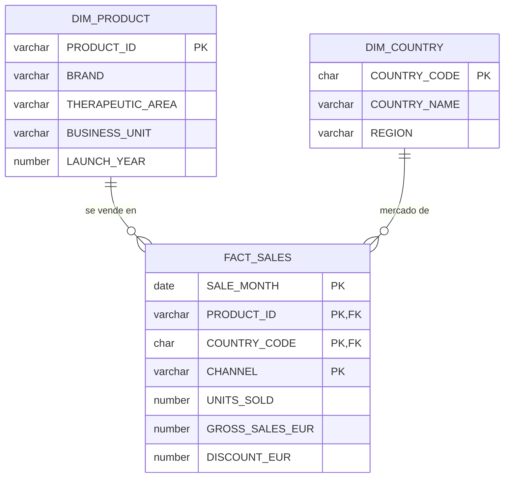

# Data Model: Dataset mock de ventas farma

**Feature**: `001-mock-sales-dataset` | **Fecha**: 2026-08-31 | **Fase**: 1

Ubicación: `CICD_DEMO.DATA`. Todos los datos son **ficticios**.

## Diagrama

---

## `DIM_PRODUCT` — 12 filas

| Columna | Tipo | Nulos | Descripción |
|---|---|---|---|
| `PRODUCT_ID` | `VARCHAR(4)` | NOT NULL, PK | `P001`..`P012` |
| `BRAND` | `VARCHAR(40)` | NOT NULL | Marca ficticia, única |
| `THERAPEUTIC_AREA` | `VARCHAR(40)` | NOT NULL | Dominio cerrado (5 valores) |
| `BUSINESS_UNIT` | `VARCHAR(20)` | NOT NULL | Dominio cerrado (2 valores) |
| `LAUNCH_YEAR` | `NUMBER(4,0)` | NOT NULL | `< 2023` (FR-005) |

### Datos

| PRODUCT_ID | BRAND | THERAPEUTIC_AREA | BUSINESS_UNIT | LAUNCH_YEAR |
|---|---|---|---|---|
| P001 | Cardiovex | Cardiometabolic | Human Pharma | 2016 |
| P002 | Glycemira | Cardiometabolic | Human Pharma | 2018 |
| P003 | Vasculin | Cardiometabolic | Human Pharma | 2014 |
| P004 | Respiralia | Respiratory | Human Pharma | 2015 |
| P005 | Bronchoflow | Respiratory | Human Pharma | 2019 |
| P006 | Pulmonex | Respiratory | Human Pharma | 2021 |
| P007 | Oncoteva | Oncology | Human Pharma | 2020 |
| P008 | Onkaris | Oncology | Human Pharma | 2022 |
| P009 | Neurosana | Central Nervous System | Human Pharma | 2017 |
| P010 | Cognivia | Central Nervous System | Human Pharma | 2013 |
| P011 | Petvitalis | Animal Health | Animal Health | 2018 |
| P012 | Vetarion | Animal Health | Animal Health | 2020 |

**Dominios**:

- `THERAPEUTIC_AREA` (5): `Cardiometabolic`, `Respiratory`, `Oncology`,
  `Central Nervous System`, `Animal Health` → cumple FR-003.
- `BUSINESS_UNIT` (2): `Human Pharma` (10 productos), `Animal Health` (2 productos) → cumple
  FR-004 (≥2 en cada una).

---

## `DIM_COUNTRY` — 10 filas

| Columna | Tipo | Nulos | Descripción |
|---|---|---|---|
| `COUNTRY_CODE` | `CHAR(2)` | NOT NULL, PK | ISO-3166 alpha-2 |
| `COUNTRY_NAME` | `VARCHAR(40)` | NOT NULL | Nombre en castellano |
| `REGION` | `VARCHAR(20)` | NOT NULL | Dominio cerrado (4 valores) |

### Datos

| COUNTRY_CODE | COUNTRY_NAME | REGION |
|---|---|---|
| BR | Brasil | LATAM |
| CA | Canada | North America |
| CN | China | APAC |
| DE | Alemania | Europe |
| ES | Espana | Europe |
| FR | Francia | Europe |
| IT | Italia | Europe |
| JP | Japon | APAC |
| MX | Mexico | LATAM |
| US | Estados Unidos | North America |

> Sin tildes ni `ñ` a propósito: evita problemas de codificación al ejecutar los `.sql` desde
> una consola Windows en cp1252 (ver restricciones del entorno).

**Dominio `REGION`** (4): `Europe` (4), `North America` (2), `LATAM` (2), `APAC` (2) → cumple
FR-007 (≥2 por región).

**Ordinal derivado** `c` = `ROW_NUMBER() OVER (ORDER BY COUNTRY_CODE)` → BR=1, CA=2, CN=3,
DE=4, ES=5, FR=6, IT=7, JP=8, MX=9, US=10.

---

## `FACT_SALES` — 12.960 filas

Grano: **mes × producto × país × canal**. Producto cartesiano completo, sin huecos (FR-011).

| Columna | Tipo | Nulos | Descripción |
|---|---|---|---|
| `SALE_MONTH` | `DATE` | NOT NULL, PK | Primer día del mes |
| `PRODUCT_ID` | `VARCHAR(4)` | NOT NULL, PK, FK → `DIM_PRODUCT` | |
| `COUNTRY_CODE` | `CHAR(2)` | NOT NULL, PK, FK → `DIM_COUNTRY` | |
| `CHANNEL` | `VARCHAR(20)` | NOT NULL, PK | Dominio cerrado (3 valores) |
| `UNITS_SOLD` | `NUMBER(10,0)` | NOT NULL | `> 0` |
| `GROSS_SALES_EUR` | `NUMBER(12,2)` | NOT NULL | `> 0` |
| `DISCOUNT_EUR` | `NUMBER(12,2)` | NOT NULL | `>= 0` y `<= 0.40 * GROSS_SALES_EUR` |

**Dominio `CHANNEL`** (3) y su ordinal `ch`:

| CHANNEL | ch | Lectura en Human Pharma | Lectura en Animal Health |
|---|---|---|---|
| `Hospital` | 1 | Hospital | Clínica veterinaria |
| `Retail Pharmacy` | 2 | Farmacia | Tienda especializada |
| `Distributor` | 3 | Mayorista | Mayorista |

**Métrica derivada** (no almacenada, ver [research D-04](research.md)):

$$\text{NET\_SALES\_EUR} = \text{GROSS\_SALES\_EUR} - \text{DISCOUNT\_EUR}$$

**Cardinalidad**: $12 \times 10 \times 3 \times 36 = 12{,}960$

**Eje temporal**: `SALE_MONTH` = `DATEADD(month, m, DATE '2023-01-01')` con
$m \in [0, 35]$ → de `2023-01-01` a `2025-12-01`.

---

## Fórmula de generación

Todas las cifras se derivan de cuatro índices enteros. No interviene ningún número aleatorio.

| Índice | Origen | Rango |
|---|---|---|
| $p$ | `TO_NUMBER(SUBSTR(PRODUCT_ID, 2))` | 1..12 |
| $c$ | `ROW_NUMBER() OVER (ORDER BY COUNTRY_CODE)` | 1..10 |
| $ch$ | ordinal del canal | 1..3 |
| $m$ | `ROW_NUMBER() OVER (ORDER BY SEQ4()) - 1` | 0..35 |

### Factores

$$
\begin{aligned}
\text{base}_p &= 500 + 137p &&\in [637,\ 2144] \\
f_{\text{país}} &= 1.00 + 0.15 \cdot (c \bmod 5) &&\in [1.00,\ 1.60] \\
f_{\text{canal}} &= \{1.0,\ 1.4,\ 0.6\}_{ch} && \\
f_{\text{tendencia}} &= 1 + 0.002 \cdot ((p \bmod 5) + 1) \cdot m &&\in [1.00,\ 1.35] \\
f_{\text{estacional}} &= 1 + 0.18 \cdot \sin\!\left(\tfrac{2\pi (m + p)}{12}\right) &&\in [0.82,\ 1.18] \\
f_{\text{ruido}} &= 0.95 + \tfrac{(7p + 13c + 29ch + 3m) \bmod 11}{100} &&\in [0.95,\ 1.05]
\end{aligned}
$$

### Medidas

$$\text{UNITS\_SOLD} = \operatorname{ROUND}\left(\text{base}_p \cdot f_{\text{país}} \cdot f_{\text{canal}} \cdot f_{\text{tendencia}} \cdot f_{\text{estacional}} \cdot f_{\text{ruido}}\right)$$

$$\text{precio}_p = 12.50 + 3.25p \qquad \text{GROSS\_SALES\_EUR} = \operatorname{ROUND}(\text{UNITS\_SOLD} \cdot \text{precio}_p,\ 2)$$

$$\text{tasa}_{\text{desc}} = \frac{5 + \left((3p + 7c + 11ch + m) \bmod 26\right)}{100} \in [0.05,\ 0.30] \qquad \text{DISCOUNT\_EUR} = \operatorname{ROUND}(\text{GROSS\_SALES\_EUR} \cdot \text{tasa}_{\text{desc}},\ 2)$$

### Qué garantiza cada pieza

| Pieza | Requisito que satisface |
|---|---|
| $f_{\text{tendencia}}$ distinto por producto | FR-016 y US2: el ranking de crecimiento interanual no empata |
| $f_{\text{estacional}}$ desfasado por producto | US2: la evolución mensual tiene forma, no es una recta |
| $f_{\text{ruido}}$ | FR-016: variación mes a mes sin recurrir a aleatoriedad |
| $f_{\text{país}}$, $f_{\text{canal}}$, $\text{base}_p$, $\text{precio}_p$ | FR-016: diferencias apreciables entre dimensiones → rankings sin empates |
| $\text{tasa}_{\text{desc}} \le 0.30$ | FR-013 y FR-014: neto siempre `> 0`, descuento dentro del 0–40% |
| Cota inferior de `UNITS_SOLD` $\approx 297$ | FR-012: unidades siempre positivas, sin necesidad de `GREATEST` |

---

## Invariantes verificables

Cada una se traduce en un test (ver [contracts/dataset-contract.md](contracts/dataset-contract.md)).

| # | Invariante | Requisito |
|---|---|---|
| I-01 | `COUNT(*)` = 12 / 10 / 12960 | FR-002, FR-006, FR-011 |
| I-02 | 36 `SALE_MONTH` distintos, consecutivos, de `2023-01-01` a `2025-12-01` | FR-010 |
| I-03 | Ninguna columna admite ni contiene nulos | FR-019 (edge case), SC-006 |
| I-04 | Toda fila de `FACT_SALES` casa con un producto y un país existentes | FR-020 |
| I-05 | `GROSS_SALES_EUR - DISCOUNT_EUR > 0` en todas las filas | FR-013, SC-006 |
| I-06 | `DISCOUNT_EUR / GROSS_SALES_EUR` entre 0 y 0.40 | FR-014 |
| I-07 | Dominios cerrados con las cardinalidades exactas (5/2/4/3) y mínimos por grupo | FR-003, FR-004, FR-007, FR-009 |
| I-08 | `LAUNCH_YEAR < 2023` para los 12 productos | FR-005 |
| I-09 | Recargar produce idénticos recuentos y agregados | FR-017, FR-018, SC-004 |
| I-10 | El top-5 de marcas por ventas netas no tiene empates | FR-016 |
| I-11 | Las 360 combinaciones producto×país×canal aparecen en los 36 meses | FR-011 |
