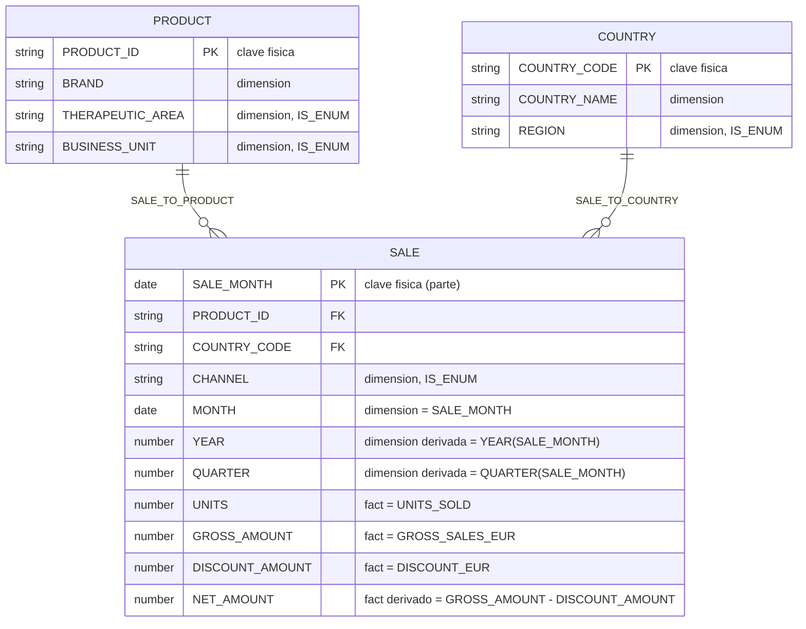

# Data Model: Semantic View de ventas para Cortex Analyst

**Feature**: `002-cortex-semantic-view` | **Fecha**: 2026-09-01 | **Fase**: 1

Modelo semántico de negocio construido sobre el esquema físico ya existente en
`CICD_DEMO.DATA` (ver [data-model.md de la feature 001](../001-mock-sales-dataset/data-model.md)).
Ninguna columna ni relación aquí descrita es nueva: todas trazan a `DIM_PRODUCT`,
`DIM_COUNTRY` o `FACT_SALES`.

> **Idioma**: nombres de tablas lógicas, dimensiones, facts, métricas y sinónimos van **en
> inglés** (ver decisión D-09 en [research.md](research.md)); esta narrativa se mantiene en
> español.

## Diagrama de tablas lógicas

## Tablas lógicas

| Alias (nombre de negocio, EN) | Tabla física | Clave primaria | Sinónimos (EN) | Descripción de negocio |
|---|---|---|---|---|
| `PRODUCT` | `DIM_PRODUCT` | `PRODUCT_ID` | products, product catalog, medicines | Catálogo de productos farmacéuticos y de salud animal vendidos. |
| `COUNTRY` | `DIM_COUNTRY` | `COUNTRY_CODE` | countries, markets, market | Catálogo de países donde se vende. |
| `SALE` | `FACT_SALES` | `SALE_MONTH, PRODUCT_ID, COUNTRY_CODE, CHANNEL` | sales, sales transactions, commercial activity | Ventas mensuales al grano mes × producto × país × canal. |

## Relaciones

| Nombre | Tabla origen (FK) | Tabla destino (PK) | Corresponde a |
|---|---|---|---|
| `SALE_TO_PRODUCT` | `SALE (PRODUCT_ID)` | `PRODUCT` | `FACT_SALES.PRODUCT_ID → DIM_PRODUCT.PRODUCT_ID` |
| `SALE_TO_COUNTRY` | `SALE (COUNTRY_CODE)` | `COUNTRY` | `FACT_SALES.COUNTRY_CODE → DIM_COUNTRY.COUNTRY_CODE` |

No hay ninguna otra relación posible entre las tres tablas: ambas claves foráneas son las
únicas declaradas en el esquema físico (ver FR-003).

## Dimensiones

| Tabla lógica | Dimensión (EN) | Expresión | Dominio | Sinónimos (EN) |
|---|---|---|---|---|
| `PRODUCT` | `BRAND` | `BRAND` | 12 valores (catálogo abierto) | brand, product name |
| `PRODUCT` | `THERAPEUTIC_AREA` | `THERAPEUTIC_AREA` | Cerrado, 5 valores (`IS_ENUM`) | therapeutic area, therapy area, specialty |
| `PRODUCT` | `BUSINESS_UNIT` | `BUSINESS_UNIT` | Cerrado, 2 valores (`IS_ENUM`) | business unit, division |
| `COUNTRY` | `COUNTRY_NAME` | `COUNTRY_NAME` | Cerrado, 10 valores (`IS_ENUM`) | country, market name |
| `COUNTRY` | `REGION` | `REGION` | Cerrado, 4 valores (`IS_ENUM`) | region, commercial region, zone |
| `SALE` | `CHANNEL` | `CHANNEL` | Cerrado, 3 valores (`IS_ENUM`) | channel, sales channel |
| `SALE` | `MONTH` | `SALE_MONTH` | 36 meses, 2023-01 a 2025-12 | month, sales month, period |
| `SALE` | `YEAR` | `YEAR(SALE_MONTH)` | 2023, 2024, 2025 | year |
| `SALE` | `QUARTER` | `QUARTER(SALE_MONTH)` | 1 a 4 | quarter |

Los valores exactos de cada dominio cerrado (para `SAMPLE_VALUES`) están fijados en
[data-model.md de la feature 001](../001-mock-sales-dataset/data-model.md) y no se repiten aquí
para no duplicar la fuente de verdad; se copian literalmente en el DDL
([contracts/semantic-view-ddl.md](contracts/semantic-view-ddl.md)).

## Facts (nivel de fila, sin agregar)

| Tabla lógica | Fact (EN) | Expresión | Descripción de negocio |
|---|---|---|---|
| `SALE` | `UNITS` | `UNITS_SOLD` | Unidades vendidas en la fila. |
| `SALE` | `GROSS_AMOUNT` | `GROSS_SALES_EUR` | Ventas brutas en euros, antes de descuento, en la fila. |
| `SALE` | `DISCOUNT_AMOUNT` | `DISCOUNT_EUR` | Descuento en euros aplicado en la fila. |
| `SALE` | `NET_AMOUNT` | `GROSS_AMOUNT - DISCOUNT_AMOUNT` | Ventas netas en euros de la fila. No almacenado físicamente (ver contrato del dataset). |

## Métricas de negocio

| Tabla lógica | Métrica (EN) | Expresión | Sinónimos (EN) | Es la métrica por defecto de... |
|---|---|---|---|---|
| `SALE` | `UNITS_SOLD` | `SUM(UNITS)` | units, units sold, volume | — |
| `SALE` | `GROSS_SALES` | `SUM(GROSS_AMOUNT)` | gross sales, gross revenue | — |
| `SALE` | `DISCOUNT` | `SUM(DISCOUNT_AMOUNT)` | discount, discounts, discount amount | — |
| `SALE` | `NET_SALES` | `SUM(NET_AMOUNT)` | **sales**, net sales, **revenue** | "sales" sin cualificar (FR-012) |
| `SALE` | `AVG_NET_SALES` | `AVG(NET_AMOUNT)` | average net sales, average sales | — |
| *(derivada, sin tabla)* | `AVG_DISCOUNT_RATE` | `DIV0(SALE.DISCOUNT, SALE.GROSS_SALES)` | discount rate, average discount rate, discount percentage | — |

Estas 6 métricas cubren el mínimo de FR-005 (unidades, brutas, descuento, netas) y añaden dos
métricas de apoyo (media y tasa de descuento) necesarias para responder Q-07 y Q-11 del
catálogo de referencia (User Story 3).

## Trazabilidad con el esquema físico (SC-005)

| Elemento del modelo semántico | Columna o clave física de origen |
|---|---|
| `PRODUCT`, `COUNTRY`, `SALE` | `DIM_PRODUCT`, `DIM_COUNTRY`, `FACT_SALES` |
| `SALE_TO_PRODUCT`, `SALE_TO_COUNTRY` | `FK_FACT_SALES_PRODUCT`, `FK_FACT_SALES_COUNTRY` (ya declaradas en `002_tables.sql`) |
| Todas las dimensiones y facts | Columnas físicas listadas arriba, sin ninguna columna adicional |
| Todas las métricas | Agregaciones (`SUM`/`AVG`) o combinación escalar (`DIV0`) de los facts anteriores |

Cero columnas, tablas o relaciones inventadas.
