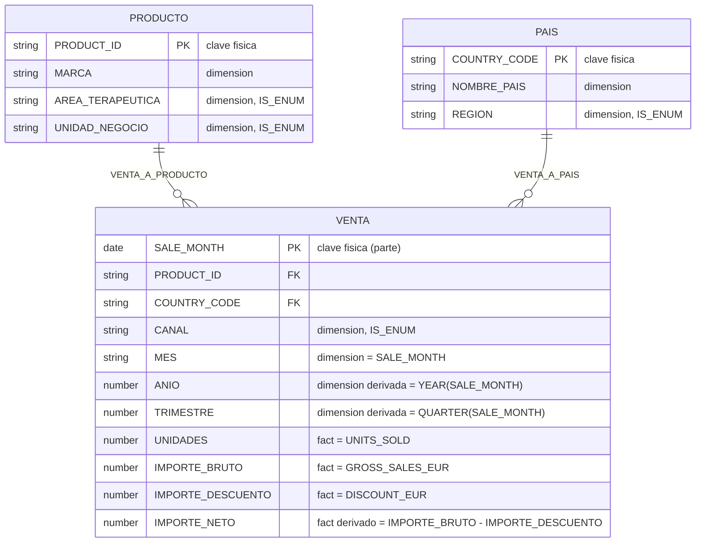

# Data Model: Semantic View de ventas para Cortex Analyst

**Feature**: `002-cortex-semantic-view` | **Fecha**: 2026-09-01 | **Fase**: 1

Modelo semántico de negocio construido sobre el esquema físico ya existente en
`CICD_DEMO.DATA` (ver [data-model.md de la feature 001](../001-mock-sales-dataset/data-model.md)).
Ninguna columna ni relación aquí descrita es nueva: todas trazan a `DIM_PRODUCT`,
`DIM_COUNTRY` o `FACT_SALES`.

## Diagrama de tablas lógicas

## Tablas lógicas

| Alias (nombre de negocio) | Tabla física | Clave primaria | Sinónimos | Descripción de negocio |
|---|---|---|---|---|
| `PRODUCTO` | `DIM_PRODUCT` | `PRODUCT_ID` | productos, catálogo de productos, medicamentos | Catálogo de productos farmacéuticos y de salud animal vendidos. |
| `PAIS` | `DIM_COUNTRY` | `COUNTRY_CODE` | países, mercados, mercado | Catálogo de países donde se vende. |
| `VENTA` | `FACT_SALES` | `SALE_MONTH, PRODUCT_ID, COUNTRY_CODE, CHANNEL` | ventas, transacciones de venta, actividad comercial | Ventas mensuales al grano mes × producto × país × canal. |

## Relaciones

| Nombre | Tabla origen (FK) | Tabla destino (PK) | Corresponde a |
|---|---|---|---|
| `VENTA_A_PRODUCTO` | `VENTA (PRODUCT_ID)` | `PRODUCTO` | `FACT_SALES.PRODUCT_ID → DIM_PRODUCT.PRODUCT_ID` |
| `VENTA_A_PAIS` | `VENTA (COUNTRY_CODE)` | `PAIS` | `FACT_SALES.COUNTRY_CODE → DIM_COUNTRY.COUNTRY_CODE` |

No hay ninguna otra relación posible entre las tres tablas: ambas claves foráneas son las
únicas declaradas en el esquema físico (ver FR-003).

## Dimensiones

| Tabla lógica | Dimensión | Expresión | Dominio | Sinónimos |
|---|---|---|---|---|
| `PRODUCTO` | `MARCA` | `BRAND` | 12 valores (catálogo abierto) | marca, producto, nombre comercial |
| `PRODUCTO` | `AREA_TERAPEUTICA` | `THERAPEUTIC_AREA` | Cerrado, 5 valores (`IS_ENUM`) | área terapéutica, categoría terapéutica, especialidad |
| `PRODUCTO` | `UNIDAD_NEGOCIO` | `BUSINESS_UNIT` | Cerrado, 2 valores (`IS_ENUM`) | unidad de negocio, línea de negocio, división |
| `PAIS` | `NOMBRE_PAIS` | `COUNTRY_NAME` | 10 valores (catálogo abierto) | país, mercado, nombre del país |
| `PAIS` | `REGION` | `REGION` | Cerrado, 4 valores (`IS_ENUM`) | región, región comercial, zona |
| `VENTA` | `CANAL` | `CHANNEL` | Cerrado, 3 valores (`IS_ENUM`) | canal, canal de venta, vía de venta |
| `VENTA` | `MES` | `SALE_MONTH` | 36 meses, 2023-01 a 2025-12 | mes, mes de venta, periodo |
| `VENTA` | `ANIO` | `YEAR(SALE_MONTH)` | 2023, 2024, 2025 | año, ano |
| `VENTA` | `TRIMESTRE` | `QUARTER(SALE_MONTH)` | 1 a 4 | trimestre, quarter |

Los valores exactos de cada dominio cerrado (para `SAMPLE_VALUES`) están fijados en
[data-model.md de la feature 001](../001-mock-sales-dataset/data-model.md) y no se repiten aquí
para no duplicar la fuente de verdad; se copian literalmente en el DDL
([contracts/semantic-view-ddl.md](contracts/semantic-view-ddl.md)).

## Facts (nivel de fila, sin agregar)

| Tabla lógica | Fact | Expresión | Descripción de negocio |
|---|---|---|---|
| `VENTA` | `UNIDADES` | `UNITS_SOLD` | Unidades vendidas en la fila. |
| `VENTA` | `IMPORTE_BRUTO` | `GROSS_SALES_EUR` | Ventas brutas en euros, antes de descuento, en la fila. |
| `VENTA` | `IMPORTE_DESCUENTO` | `DISCOUNT_EUR` | Descuento en euros aplicado en la fila. |
| `VENTA` | `IMPORTE_NETO` | `IMPORTE_BRUTO - IMPORTE_DESCUENTO` | Ventas netas en euros de la fila. No almacenado físicamente (ver contrato del dataset). |

## Métricas de negocio

| Tabla lógica | Métrica | Expresión | Sinónimos | Es la métrica por defecto de... |
|---|---|---|---|---|
| `VENTA` | `UNIDADES_VENDIDAS` | `SUM(UNIDADES)` | unidades, unidades vendidas, volumen | — |
| `VENTA` | `VENTAS_BRUTAS` | `SUM(IMPORTE_BRUTO)` | ventas brutas, facturación bruta, ingresos brutos | — |
| `VENTA` | `DESCUENTO` | `SUM(IMPORTE_DESCUENTO)` | descuento, descuentos, importe descontado | — |
| `VENTA` | `VENTAS_NETAS` | `SUM(IMPORTE_NETO)` | **ventas**, ventas netas, **ingresos**, **facturación** | "ventas" sin cualificar (FR-012) |
| `VENTA` | `VENTAS_NETAS_MEDIA` | `AVG(IMPORTE_NETO)` | media de ventas netas, promedio de ventas netas | — |
| *(derivada, sin tabla)* | `TASA_DESCUENTO_MEDIA` | `DIV0(VENTA.DESCUENTO, VENTA.VENTAS_BRUTAS)` | tasa de descuento, porcentaje de descuento, descuento medio | — |

Estas 6 métricas cubren el mínimo de FR-005 (unidades, brutas, descuento, netas) y añaden dos
métricas de apoyo (media y tasa de descuento) necesarias para responder Q-07 y Q-11 del
catálogo de referencia (User Story 3).

## Trazabilidad con el esquema físico (SC-005)

| Elemento del modelo semántico | Columna o clave física de origen |
|---|---|
| `PRODUCTO`, `PAIS`, `VENTA` | `DIM_PRODUCT`, `DIM_COUNTRY`, `FACT_SALES` |
| `VENTA_A_PRODUCTO`, `VENTA_A_PAIS` | `FK_FACT_SALES_PRODUCT`, `FK_FACT_SALES_COUNTRY` (ya declaradas en `002_tables.sql`) |
| Todas las dimensiones y facts | Columnas físicas listadas arriba, sin ninguna columna adicional |
| Todas las métricas | Agregaciones (`SUM`/`AVG`) o combinación escalar (`DIV0`) de los facts anteriores |

Cero columnas, tablas o relaciones inventadas.
