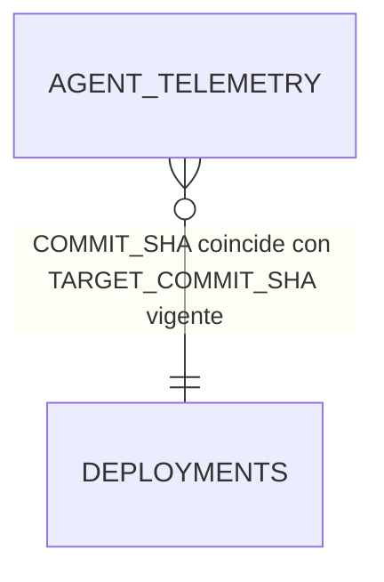
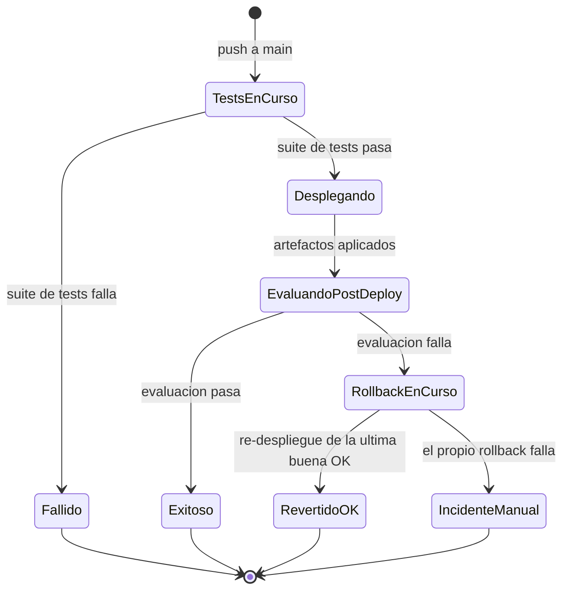

# Fase 1 — Data Model: Pipeline de CI/CD

**Feature**: [004-ci-cd-pipeline](./spec.md) · **Plan**: [plan.md](./plan.md) ·
**Research**: [research.md](./research.md)

## Entidades

### `Deployment` (tabla `CICD_DEMO.DEVOPS.DEPLOYMENTS`, insert-only)

Una fila por cada acción que cambia (o intenta cambiar) lo que está desplegado en Snowflake.

| Campo | Tipo | Obligatorio | Descripción |
|---|---|---|---|
| `DEPLOYMENT_ID` | `STRING` (UUID) | Sí | Identificador único de la fila. |
| `ACTION` | `STRING` | Sí | `DEPLOY` (merge normal) \| `AUTO_ROLLBACK` \| `MANUAL_REVERT`. |
| `TARGET_COMMIT_SHA` | `STRING` | Sí | Commit que queda desplegado tras esta acción. |
| `PREVIOUS_COMMIT_SHA` | `STRING` | No | Commit que estaba desplegado antes (vacío en el primer despliegue del proyecto). |
| `STATUS` | `STRING` | Sí | `SUCCESS` \| `FAILED`. |
| `REASON` | `STRING` | No | Motivo legible (p. ej. resultado de test que falló en la evaluación post-deploy). |
| `TRIGGERED_BY` | `STRING` | Sí | `github-actions[bot]` para acciones automáticas, o el usuario de GitHub que disparó `revert.yml`. |
| `WORKFLOW_RUN_URL` | `STRING` | Sí | URL del run de GitHub Actions que generó la fila. |
| `DEPLOYED_AT` | `TIMESTAMP_NTZ` | Sí | Momento en que se registra la fila. |

**Validación**: `ACTION = 'AUTO_ROLLBACK'` o `'MANUAL_REVERT'` MUST llevar `PREVIOUS_COMMIT_SHA`
relleno (siempre hay un estado anterior del que se viene). `ACTION = 'DEPLOY'` puede tener
`PREVIOUS_COMMIT_SHA` vacío solo en la primera fila de la tabla.

**Relación con FR**: FR-008, FR-009, FR-010, FR-011, FR-013, FR-014, SC-002, SC-005.

---

### ⚠️ `SemanticViewVersion` / `SemanticViewActive` — eliminadas (ADR-003)

Este documento incluía originalmente dos entidades más: `SemanticViewVersion` (tabla
`SEMANTIC_VIEW_VERSIONS`, historial insert-only de versiones físicas de la semantic view) y
`SemanticViewActive` (tabla `SEMANTIC_VIEW_ACTIVE`, puntero mutable a la versión activa).

Se eliminaron por [ADR-003](decisions/003-simplificacion-semantic-view.md): duplicaban en
Snowflake un historial que ya vive en Git (`snowflake/004_semantic_view.sql`). La semantic view
es ahora un único objeto físico (`SV_PHARMA_SALES`), sin entidad de datos propia — se gobierna
igual que cualquier otro script SQL idempotente de `snowflake/`.

---

## Relaciones

- `AGENT_TELEMETRY` (feature 003, ya existente) no se modifica; su columna `COMMIT_SHA` es la
  fuente de evidencia "qué versión está respondiendo de verdad ahora mismo" (ver
  [ADR-002](decisions/002-rollback-automatico.md)).
- No hay clave foránea física entre estas tablas (Snowflake no las impone de forma habitual para
  este tipo de tablas de auditoría); la relación es lógica, por `COMMIT_SHA`.

## Máquina de estados de un `Deployment`

Cada transición final (`Exitoso`, `Fallido` no llega a insertar fila porque nunca se desplegó
nada, `RevertidoOK`, `IncidenteManual`) corresponde a una fila en `DEPLOYMENTS`, salvo `Fallido`
en el primer job de tests (ahí no hay nada que registrar como despliegue: el pipeline se detiene
antes de tocar Snowflake, coherente con FR-006).
