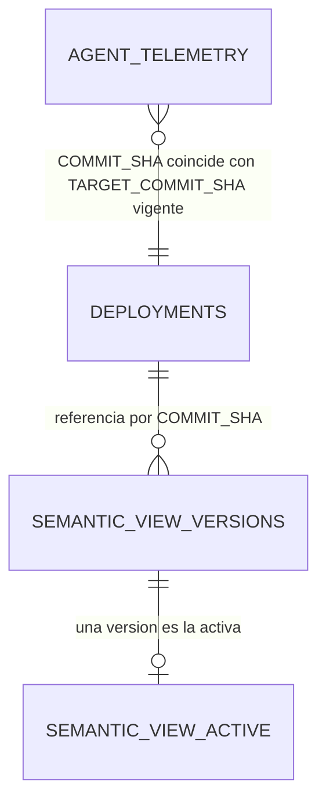
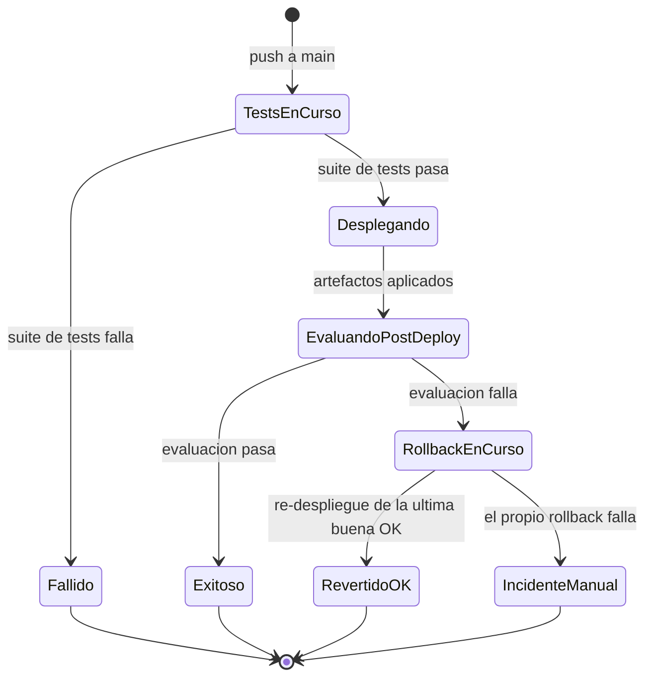

# Fase 1 — Data Model: Pipeline de CI/CD

**Feature**: [004-ci-cd-pipeline](./spec.md) · **Plan**: [plan.md](./plan.md) ·
**Research**: [research.md](./research.md)

## Entidades

### `Deployment` (tabla `CICD_DEMO.DEVOPS.DEPLOYMENTS`, insert-only)

Una fila por cada acción que cambia (o intenta cambiar) lo que está desplegado en Snowflake.

| Campo | Tipo | Obligatorio | Descripción |
|---|---|---|---|
| `DEPLOYMENT_ID` | `STRING` (UUID) | Sí | Identificador único de la fila. |
| `ACTION` | `STRING` | Sí | `DEPLOY` (merge normal) \| `AUTO_ROLLBACK` \| `MANUAL_REVERT`. |
| `TARGET_COMMIT_SHA` | `STRING` | Sí | Commit que queda desplegado tras esta acción. |
| `PREVIOUS_COMMIT_SHA` | `STRING` | No | Commit que estaba desplegado antes (vacío en el primer despliegue del proyecto). |
| `STATUS` | `STRING` | Sí | `SUCCESS` \| `FAILED`. |
| `REASON` | `STRING` | No | Motivo legible (p. ej. resultado de test que falló en la evaluación post-deploy). |
| `TRIGGERED_BY` | `STRING` | Sí | `github-actions[bot]` para acciones automáticas, o el usuario de GitHub que disparó `revert.yml`. |
| `WORKFLOW_RUN_URL` | `STRING` | Sí | URL del run de GitHub Actions que generó la fila. |
| `DEPLOYED_AT` | `TIMESTAMP_NTZ` | Sí | Momento en que se registra la fila. |

**Validación**: `ACTION = 'AUTO_ROLLBACK'` o `'MANUAL_REVERT'` MUST llevar `PREVIOUS_COMMIT_SHA`
relleno (siempre hay un estado anterior del que se viene). `ACTION = 'DEPLOY'` puede tener
`PREVIOUS_COMMIT_SHA` vacío solo en la primera fila de la tabla.

**Relación con FR**: FR-008, FR-009, FR-010, FR-011, FR-013, FR-014, SC-002, SC-005.

---

### `SemanticViewVersion` (tabla `CICD_DEMO.DEVOPS.SEMANTIC_VIEW_VERSIONS`, insert-only)

Una fila por cada versión de una semantic view que se ha desplegado como objeto físico,
incluidas las candidatas de PR (ver research.md, D-04).

| Campo | Tipo | Obligatorio | Descripción |
|---|---|---|---|
| `VERSION_ID` | `NUMBER` (autoincrement) | Sí | Clave interna. |
| `BASE_NAME` | `STRING` | Sí | Nombre lógico de la semantic view, p. ej. `SV_PHARMA_SALES`. |
| `OBJECT_NAME` | `STRING` | Sí | Nombre físico del objeto en Snowflake, p. ej. `SV_PHARMA_SALES_V1A2B3C4`. |
| `COMMIT_SHA` | `STRING` | Sí | Commit del que procede esta definición. |
| `DDL_TEXT` | `STRING` | Sí | Sentencia `CREATE OR ALTER SEMANTIC VIEW` completa que generó este objeto. |
| `IS_CANDIDATE` | `BOOLEAN` | Sí | `TRUE` si se desplegó solo para validar una PR (D-04); `FALSE` si es una versión de producción. |
| `DEPLOYED_AT` | `TIMESTAMP_NTZ` | Sí | Momento del despliegue. |

**Validación**: `OBJECT_NAME` MUST ser único. El objeto físico puede dejar de existir con el
tiempo (política de retención, D-06) sin que la fila se borre: `DDL_TEXT` sigue permitiendo
recrearlo.

**Relación con FR**: FR-016, FR-017, FR-018, FR-020, SC-006, SC-007.

---

### `SemanticViewActive` (tabla de configuración `CICD_DEMO.DEVOPS.SEMANTIC_VIEW_ACTIVE`, mutable)

Una fila por cada semantic view base. Es el **puntero** que resuelve `cortex_analyst.py` en
tiempo de ejecución. A diferencia de las dos anteriores, esta tabla se actualiza in place: no es
un histórico, es el estado actual.

| Campo | Tipo | Obligatorio | Descripción |
|---|---|---|---|
| `BASE_NAME` | `STRING` (PK) | Sí | p. ej. `SV_PHARMA_SALES`. |
| `ACTIVE_OBJECT_NAME` | `STRING` | Sí | Objeto físico actualmente activo. |
| `ACTIVE_COMMIT_SHA` | `STRING` | Sí | Commit al que corresponde esa versión. |
| `UPDATED_AT` | `TIMESTAMP_NTZ` | Sí | Última vez que cambió el puntero. |
| `UPDATED_BY` | `STRING` | Sí | Quién/qué lo cambió (mismo valor que `TRIGGERED_BY` de la fila de `DEPLOYMENTS` correspondiente). |

**Relación con FR**: FR-018, FR-019.

---

## Relaciones

- `AGENT_TELEMETRY` (feature 003, ya existente) no se modifica; su columna `COMMIT_SHA` es la
  fuente de evidencia "qué versión está respondiendo de verdad ahora mismo" (ver
  [ADR-002](decisions/002-rollback-automatico.md)).
- No hay clave foránea física entre estas tablas (Snowflake no las impone de forma habitual para
  este tipo de tablas de auditoría); la relación es lógica, por `COMMIT_SHA` / `BASE_NAME`.

## Máquina de estados de un `Deployment`

Cada transición final (`Exitoso`, `Fallido` no llega a insertar fila porque nunca se desplegó
nada, `RevertidoOK`, `IncidenteManual`) corresponde a una fila en `DEPLOYMENTS`, salvo `Fallido`
en el primer job de tests (ahí no hay nada que registrar como despliegue: el pipeline se detiene
antes de tocar Snowflake, coherente con FR-006).
